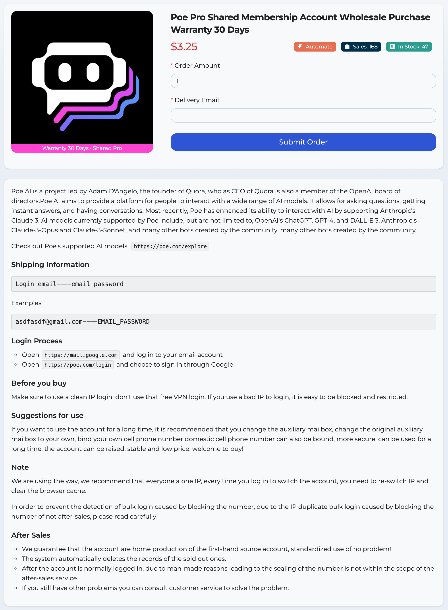

# Free Poe AI Pro Shared & Exclusive Membership Account Wholesale Purchase

Website: [https://allshop.vip](https://allshop.vip/?_referrer=adgithubbdakx)



Poe AI is a project led by Adam D'Angelo, the founder of Quora, who as CEO of Quora is also a member of the OpenAI board of directors.Poe AI aims to provide a platform for people to interact with a wide range of AI models. It allows for asking questions, getting instant answers, and having conversations. Most recently, Poe has enhanced its ability to interact with AI by supporting Anthropic's Claude 3. AI models currently supported by Poe include, but are not limited to, OpenAI's ChatGPT, GPT-4, and DALL-E 3, Anthropic's Claude-3-Opus and Claude-3-Sonnet, and many other bots created by the community. many other bots created by the community.

Check out Poe's supported AI models: `https://poe.com/explore`

##### Shipping Information

```
Login email----email password
```

Examples

```
asdfasdf@gmail.com----EMAIL_PASSWORD
```

##### Login Process

- Open `https://mail.google.com` and log in to your email account
- Open `https://poe.com/login` and choose to sign in through Google.
